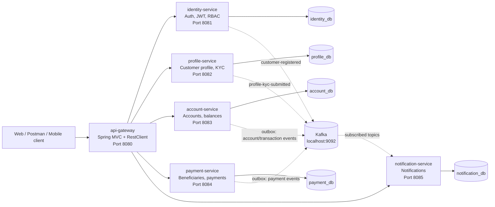
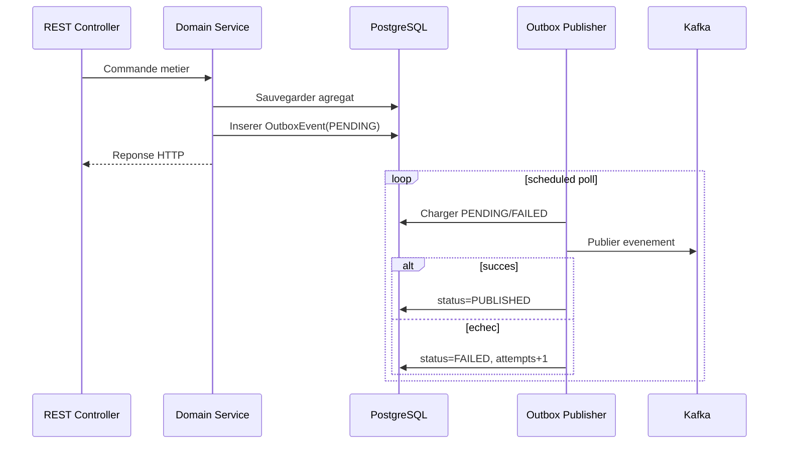
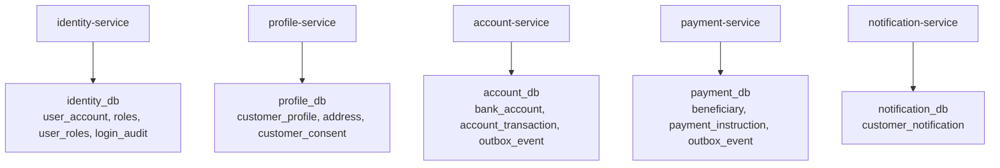
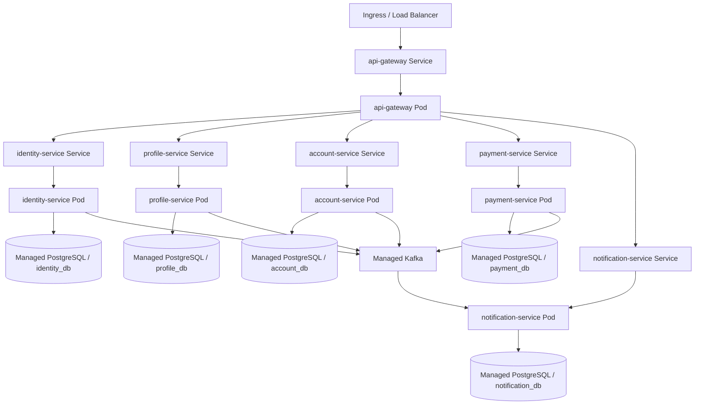

# Banking Account Management System - Architecture Microservices

## 1. Objectif du document

Ce document decrit l'architecture conceptuelle de l'application `banking-app`, alignee avec le code actuel.

L'application est une plateforme bancaire moderne organisee en microservices Spring Boot. Elle permet la gestion des identites, des profils client, des comptes bancaires, des paiements, des notifications et des acces securises.

## 2. Vue globale

Le systeme est compose de six applications executables et d'un module partage:

| Module | Port local | Responsabilite |
| --- | ---: | --- |
| `api-gateway` | `8080` | Point d'entree API, proxy REST, pages Thymeleaf dashboard/login |
| `identity-service` | `8081` | Authentification, JWT, roles, utilisateurs, audit login |
| `profile-service` | `8082` | Profil client, KYC, consentements, adresses |
| `account-service` | `8083` | Comptes, soldes, limites, transactions, gel/degel |
| `payment-service` | `8084` | Beneficiaires, ordres de paiement, risque, approbation |
| `notification-service` | `8085` | Notifications client creees depuis les evenements Kafka |
| `banking-common` | n/a | DTO/erreurs/securite/validation/evenements partages |

## 3. Diagramme d'architecture applicative



## 4. Style architectural

L'application applique une architecture microservices avec ownership de donnees par domaine.

Chaque service possede:

- son port HTTP;
- son schema/base PostgreSQL;
- ses controllers REST;
- sa logique de service;
- ses repositories JPA;
- ses migrations Flyway;
- ses configurations Spring profiles;
- ses regles de securite locales;
- son Swagger/OpenAPI.

Le module `banking-common` centralise les elements transverses:

- `ApiError` et `GlobalExceptionHandler`;
- exceptions communes;
- validation IBAN;
- roles et permissions;
- helpers JWT;
- evenements Kafka communs.

## 5. Bounded contexts

| Bounded context | Service | Donnees principales |
| --- | --- | --- |
| Identity and Access | `identity-service` | `UserAccount`, `Role`, `LoginAudit` |
| Customer Profile | `profile-service` | `CustomerProfile`, `Address`, `CustomerConsent` |
| Account Management | `account-service` | `BankAccount`, `AccountTransaction`, `OutboxEvent` |
| Payment Management | `payment-service` | `Beneficiary`, `PaymentInstruction`, `OutboxEvent` |
| Notification | `notification-service` | `CustomerNotification` |

## 6. Communication REST

Le client appelle de preference le gateway:

```text
http://localhost:8080
```

Le gateway route les chemins suivants:

| Route gateway | Service cible |
| --- | --- |
| `/api/auth/**` | `identity-service` |
| `/api/admin/users/**` | `identity-service` |
| `/api/profiles/**` | `profile-service` |
| `/api/accounts/**` | `account-service` |
| `/api/payments/**` | `payment-service` |
| `/api/notifications/**` | `notification-service` |

## 7. Communication evenementielle

Kafka est utilise pour propager les evenements metiers.

| Topic | Producteur | Consommateur actuel | Evenement |
| --- | --- | --- | --- |
| `customer-registered` | `identity-service` | `notification-service` | Creation utilisateur client |
| `profile-kyc-submitted` | `profile-service` | `notification-service` | Soumission KYC |
| `account-opened` | `account-service` | `notification-service` | Ouverture de compte |
| `account-frozen` | `account-service` | `notification-service` | Gel de compte |
| `transaction-posted` | `account-service` | `notification-service` | Transaction comptable |
| `payment-initiated` | `payment-service` | `notification-service` | Paiement initie |
| `payment-approved` | `payment-service` | `notification-service` | Paiement approuve et planifie |
| `payment-executed` | `payment-service` | `notification-service` | Paiement execute |
| `payment-rejected` | `payment-service` | `notification-service` | Paiement rejete |

## 8. Fiabilite Kafka et outbox

Le code applique deux strategies:

1. Publication directe dans `identity-service` et `profile-service`.
2. Outbox transactionnelle dans `account-service` et `payment-service`.

Le pattern outbox permet de sauvegarder l'evenement dans la meme transaction que la modification metier, puis de publier en asynchrone avec retry.



## 9. Securite applicative

L'authentification principale est JWT.

Flux:

1. Le client appelle `/api/auth/login`.
2. `identity-service` verifie username/email + password.
3. `identity-service` emet un JWT HS256.
4. Le client envoie `Authorization: Bearer <token>`.
5. Gateway et services valident le token.
6. Les roles sont lus depuis le claim `roles`.

Roles actuels:

```text
ADMIN
CUSTOMER
SUPPORT
COMPLIANCE
AUDITOR
```

Permissions configurees:

```text
MANAGE_USERS
MANAGE_ROLES
VIEW_CUSTOMERS
MANAGE_KYC
VIEW_ACCOUNTS
MANAGE_ACCOUNTS
INITIATE_PAYMENTS
APPROVE_PAYMENTS
VIEW_AUDIT
VIEW_NOTIFICATIONS
```

## 10. Matrice d'acces principale

| Endpoint | Role requis |
| --- | --- |
| `/api/auth/register` | Public |
| `/api/auth/login` | Public |
| `/api/admin/users/**` | `ADMIN` |
| `/api/profiles/me/**` | Authentifie |
| `/api/profiles/admin/**` | `ADMIN`, `COMPLIANCE`, `SUPPORT` |
| `/api/accounts` | Authentifie |
| `/api/accounts/{id}` | Proprietaire du compte |
| `/api/accounts/admin/**` | `ADMIN`, `SUPPORT` |
| `/api/payments` | Authentifie |
| `/api/payments/admin/**` | `ADMIN`, `COMPLIANCE`, `SUPPORT` |
| `/api/notifications` | Authentifie |

## 11. Donnees et isolation

Chaque microservice possede sa base:



Cette separation evite le couplage direct entre domaines. Les references inter-services sont stockees comme identifiants metier simples, par exemple `customerId`, `userId`, `sourceAccountId`.

## 12. Profiles Spring

Les profiles attendus sont:

```text
dev
tst
uat
pp
prod
```

Le profil `dev` actuel pointe vers:

```text
PostgreSQL localhost:5432
Kafka localhost:9092
JWT secret local
logging DEBUG pour com.example.banking
```

## 13. Deploiement local sans Docker

Mode recommande pour developpement leger:

```text
PostgreSQL local installe comme service Windows
Kafka local seulement si test des notifications/evenements
Services Spring lances depuis IntelliJ ou Maven
Gateway utilise comme point d'entree unique
```

Ordre de lancement:

```text
1. PostgreSQL
2. Kafka optionnel
3. identity-service
4. profile-service
5. account-service
6. payment-service
7. notification-service optionnel si Kafka est actif
8. api-gateway
```

## 14. Deploiement Kubernetes conceptuel



## 15. Points d'attention alignes avec le code actuel

- Les APIs exposent des IDs `Long`. Pour une banque en production, il est recommande d'ajouter un `publicId UUID` expose a l'exterieur et de garder le `Long` comme identifiant interne.
- Le changement/reset de mot de passe n'est pas encore expose en API.
- Les notifications necessitent Kafka pour le scenario complet.
- `identity-service` et `profile-service` publient directement vers Kafka; `account-service` et `payment-service` utilisent l'outbox.
- Le JWT utilise un secret partage HS256; pour production, preferer rotation de secrets ou signature asymetrique avec JWKS.

