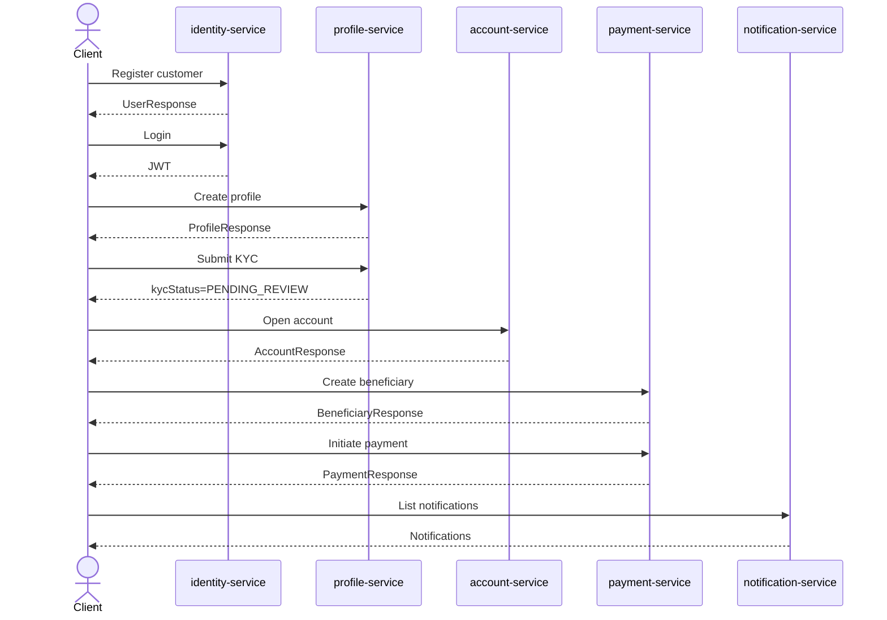

# Banking Account Management System - Fonctionnalites Metier

## 1. Objectif

Ce document decrit les fonctionnalites metier supportees par le code actuel de l'application bancaire microservices.

Le systeme couvre les domaines suivants:

- authentification et gestion d'acces;
- creation et administration des profils client;
- gestion des comptes bancaires;
- gestion des transactions;
- gestion des beneficiaires;
- initiation, approbation, rejet et annulation des paiements;
- notifications client basees sur evenements.

## 2. Acteurs

| Acteur | Role technique | Description |
| --- | --- | --- |
| Client bancaire | `CUSTOMER` | Cree son profil, consulte ses comptes, initie des paiements |
| Administrateur | `ADMIN` | Gere les utilisateurs, roles et acces |
| Support bancaire | `SUPPORT` | Consulte des profils, gere certains comptes, assiste les clients |
| Compliance officer | `COMPLIANCE` | Consulte profils/KYC, approuve ou rejette les paiements sensibles |
| Auditeur | `AUDITOR` | Role prevu pour consultation/audit, peu expose dans les endpoints actuels |

## 3. Vue use cases metier

```mermaid
flowchart LR
    Customer["Client bancaire"]
    Admin["Administrateur"]
    Support["Support"]
    Compliance["Compliance"]
    Auditor["Auditeur"]

    UCRegister(("Creer compte client"))
    UCLogin(("Se connecter"))
    UCProfile(("Gerer profil"))
    UCKyc(("Soumettre KYC"))
    UCConsent(("Donner consentement"))
    UCOpenAccount(("Ouvrir compte"))
    UCStatement(("Consulter releve"))
    UCLimits(("Modifier limite"))
    UCBeneficiary(("Gerer beneficiaires"))
    UCPayment(("Initier paiement"))
    UCCancel(("Annuler paiement"))
    UCNotification(("Consulter notifications"))

    UCUsers(("Gerer utilisateurs"))
    UCRoles(("Gerer roles"))
    UCLock(("Bloquer utilisateur"))
    UCAdminProfile(("Consulter profil client"))
    UCFreeze(("Geler / degeler compte"))
    UCManualTxn(("Poster transaction manuelle"))
    UCApprove(("Approuver paiement"))
    UCReject(("Rejeter paiement"))
    UCAudit(("Consulter audit"))

    Customer --> UCRegister
    Customer --> UCLogin
    Customer --> UCProfile
    Customer --> UCKyc
    Customer --> UCConsent
    Customer --> UCOpenAccount
    Customer --> UCStatement
    Customer --> UCLimits
    Customer --> UCBeneficiary
    Customer --> UCPayment
    Customer --> UCCancel
    Customer --> UCNotification

    Admin --> UCUsers
    Admin --> UCRoles
    Admin --> UCLock
    Admin --> UCAdminProfile
    Admin --> UCFreeze
    Admin --> UCManualTxn
    Admin --> UCApprove
    Admin --> UCReject

    Support --> UCAdminProfile
    Support --> UCFreeze
    Support --> UCManualTxn
    Support --> UCApprove
    Support --> UCReject

    Compliance --> UCAdminProfile
    Compliance --> UCApprove
    Compliance --> UCReject
    Compliance --> UCAudit

    Auditor --> UCAudit
```



## 4. Domaine Identity and Access

### Fonctionnalites disponibles

| Fonctionnalite | Endpoint |
| --- | --- |
| Enregistrer un client | `POST /api/auth/register` |
| Login username/password | `POST /api/auth/login` |
| Lister les utilisateurs | `GET /api/admin/users` |
| Modifier les roles | `PUT /api/admin/users/{id}/roles` |
| Bloquer un utilisateur | `PATCH /api/admin/users/{id}/lock` |
| Activer/desactiver MFA flag | `PATCH /api/admin/users/{id}/mfa` |
| SSO Google | `/oauth2/authorization/google` cote navigateur |

### Regles metier

- Un username doit etre unique.
- Un email doit etre unique.
- Le mot de passe a la creation doit etre fort:
  - minimum 12 caracteres;
  - au moins une majuscule;
  - au moins une minuscule;
  - au moins un chiffre;
  - au moins un caractere special.
- Le mot de passe est hashe avec `PasswordEncoderFactories.createDelegatingPasswordEncoder()`.
- Le compte est verrouille apres 5 echecs de login.
- Les roles sont portes dans le JWT via le claim `roles`.

### Limitations actuelles

Les APIs suivantes ne sont pas encore presentes dans le code:

- changer son mot de passe;
- reset mot de passe par email;
- forgot password;
- deverrouillage utilisateur par API;
- verification MFA reelle par code OTP.

## 5. Domaine Customer Profile

### Fonctionnalites disponibles

| Fonctionnalite | Endpoint |
| --- | --- |
| Creer son profil | `POST /api/profiles/me` |
| Consulter son profil | `GET /api/profiles/me` |
| Modifier son profil | `PUT /api/profiles/me` |
| Soumettre KYC | `POST /api/profiles/me/kyc` |
| Capturer consentement | `POST /api/profiles/me/consents` |
| Consultation profil par back-office | `GET /api/profiles/admin/{userId}` |

### Donnees profil

Un profil contient:

- `userId` venant du JWT;
- `customerNumber` genere;
- nom, prenom, email, telephone;
- date de naissance;
- nationalite;
- pays de residence fiscale;
- statut KYC;
- scoring de risque;
- adresses;
- consentements.

### Regles metier

- Un utilisateur ne peut avoir qu'un seul profil.
- La creation d'un deuxieme profil retourne une violation metier.
- La soumission KYC passe le profil en `PENDING_REVIEW`.
- Les consentements sont historises avec `capturedAt`.

## 6. Domaine Account Management

### Fonctionnalites disponibles

| Fonctionnalite | Endpoint |
| --- | --- |
| Ouvrir un compte | `POST /api/accounts` |
| Lister ses comptes | `GET /api/accounts` |
| Consulter un compte | `GET /api/accounts/{id}` |
| Consulter le releve | `GET /api/accounts/{id}/statement` |
| Modifier limite de transfert | `PUT /api/accounts/{id}/limits` |
| Geler compte | `PATCH /api/accounts/admin/{id}/freeze` |
| Degeler compte | `PATCH /api/accounts/admin/{id}/unfreeze` |
| Poster transaction manuelle | `POST /api/accounts/admin/{id}/transactions` |

### Types de comptes

```text
CHECKING
SAVINGS
BUSINESS
MULTI_CURRENCY
```

### Statuts de compte

```text
ACTIVE
FROZEN
CLOSED
```

### Types de transactions

```text
CREDIT
DEBIT
HOLD
RELEASE
```

### Regles metier

- L'IBAN du compte est genere par le service.
- La devise par defaut est `EUR`.
- La limite journaliere par defaut est `5000.00`.
- Un compte est cree avec statut `ACTIVE`.
- Si `openingBalance > 0`, une transaction `CREDIT` est creee.
- Une transaction avec reference dupliquee est refusee.
- Un debit superieur au solde disponible est refuse.
- Une transaction sur compte non actif est refusee.
- Seul le proprietaire peut consulter son compte ou son releve.
- `ADMIN` et `SUPPORT` peuvent geler/degeler et poster des transactions manuelles.

## 7. Domaine Payment Management

### Fonctionnalites disponibles

| Fonctionnalite | Endpoint |
| --- | --- |
| Creer beneficiaire | `POST /api/payments/beneficiaries` |
| Lister beneficiaires | `GET /api/payments/beneficiaries` |
| Initier paiement | `POST /api/payments` |
| Lister ses paiements | `GET /api/payments` |
| Annuler paiement | `POST /api/payments/{id}/cancel` |
| Approuver paiement | `POST /api/payments/admin/{id}/approve` |
| Rejeter paiement | `POST /api/payments/admin/{id}/reject` |

### Types de paiement

```text
INTERNAL
SEPA
SWIFT
STANDING_ORDER
```

### Statuts de paiement

```text
DRAFT
PENDING_MFA
PENDING_APPROVAL
APPROVED
SCHEDULED
EXECUTED
REJECTED
CANCELLED
```

### Regles metier

- Tout paiement doit porter un header `Idempotency-Key`.
- Le beneficiaire doit appartenir au client authentifie.
- Le paiement stocke `customerId`, `sourceAccountId`, `sourceIban`, `beneficiary`, `amount`, `currency`, `riskScore`.
- Un paiement faible risque demarre en `PENDING_MFA`.
- Un paiement haut risque demarre en `PENDING_APPROVAL`.
- Le haut risque est declenche par:
  - montant `>= 10000.00`;
  - type `SWIFT`;
  - score de risque superieur ou egal au seuil configure.
- Un paiement execute ne peut pas etre annule.
- L'approbation est reservee a `ADMIN`, `COMPLIANCE`, `SUPPORT`.
- Si le paiement approuve n'est pas planifie, il devient `EXECUTED`.
- Si le paiement approuve est planifie dans le futur, il devient `SCHEDULED`.

## 8. Domaine Notification

### Fonctionnalites disponibles

| Fonctionnalite | Endpoint |
| --- | --- |
| Lister mes notifications | `GET /api/notifications` |
| Marquer une notification comme lue | `PATCH /api/notifications/{id}/read` |

### Canaux

```text
IN_APP
EMAIL
SMS
PUSH
```

### Statuts

```text
UNREAD
READ
FAILED
```

### Regles metier

- Les notifications sont creees a partir des evenements Kafka.
- Chaque notification est rattachee a un `customerId`.
- Un client ne peut lire que ses propres notifications.
- Le statut passe de `UNREAD` a `READ` avec l'endpoint `markRead`.

## 9. Parcours client complet



## 10. Scenarios metier prioritaires a tester

| Scenario | Resultat attendu |
| --- | --- |
| Creation client avec mot de passe fort | `201 Created` |
| Creation client avec mot de passe faible | `400 VALIDATION_ERROR` |
| Login correct | JWT retourne |
| 5 logins incorrects | utilisateur `LOCKED` |
| Creation profil | profil cree |
| Creation profil duplique | `409 BUSINESS_RULE_VIOLATION` |
| Ouverture compte avec solde initial | compte + transaction credit |
| Debit superieur au solde | `409 BUSINESS_RULE_VIOLATION` |
| Gel compte puis transaction | transaction refusee |
| Paiement faible risque | `PENDING_MFA` |
| Paiement SWIFT ou montant eleve | `PENDING_APPROVAL` |
| Approbation compliance | `EXECUTED` ou `SCHEDULED` |
| Rejet compliance | `REJECTED` |
| Rejeu meme `Idempotency-Key` | meme paiement retourne |
| Consultation admin avec token customer | `403 ACCESS_DENIED` |

