# Banking Account Management System - Diagrammes UML

Ce document regroupe les diagrammes conceptuels principaux de l'application `banking-app`.

Les diagrammes sont ecrits en Mermaid pour etre exploitables dans GitLab, IntelliJ, VS Code et plusieurs viewers Markdown.

## 1. Diagramme UML - Cas d'utilisation

```mermaid
flowchart LR
    Customer["Actor: CUSTOMER"]
    Admin["Actor: ADMIN"]
    Support["Actor: SUPPORT"]
    Compliance["Actor: COMPLIANCE"]
    Auditor["Actor: AUDITOR"]

    subgraph Identity["Identity and Access"]
        Register(("Register customer"))
        Login(("Login"))
        ManageUsers(("Manage users"))
        ManageRoles(("Manage roles"))
        LockUser(("Lock user"))
        Mfa(("Enable / disable MFA flag"))
    end

    subgraph Profile["Customer Profile"]
        CreateProfile(("Create profile"))
        UpdateProfile(("Update profile"))
        SubmitKyc(("Submit KYC"))
        CaptureConsent(("Capture consent"))
        ViewCustomer(("View customer profile"))
    end

    subgraph Account["Account Management"]
        OpenAccount(("Open account"))
        ListAccounts(("List accounts"))
        Statement(("View statement"))
        SetLimit(("Set daily limit"))
        FreezeAccount(("Freeze / unfreeze account"))
        ManualTxn(("Post manual transaction"))
    end

    subgraph Payment["Payment Management"]
        CreateBeneficiary(("Create beneficiary"))
        InitiatePayment(("Initiate payment"))
        CancelPayment(("Cancel payment"))
        ApprovePayment(("Approve payment"))
        RejectPayment(("Reject payment"))
    end

    subgraph Notification["Notification"]
        ListNotifications(("List notifications"))
        MarkRead(("Mark notification read"))
    end

    Customer --> Register
    Customer --> Login
    Customer --> CreateProfile
    Customer --> UpdateProfile
    Customer --> SubmitKyc
    Customer --> CaptureConsent
    Customer --> OpenAccount
    Customer --> ListAccounts
    Customer --> Statement
    Customer --> SetLimit
    Customer --> CreateBeneficiary
    Customer --> InitiatePayment
    Customer --> CancelPayment
    Customer --> ListNotifications
    Customer --> MarkRead

    Admin --> ManageUsers
    Admin --> ManageRoles
    Admin --> LockUser
    Admin --> Mfa
    Admin --> ViewCustomer
    Admin --> FreezeAccount
    Admin --> ManualTxn
    Admin --> ApprovePayment
    Admin --> RejectPayment

    Support --> ViewCustomer
    Support --> FreezeAccount
    Support --> ManualTxn
    Support --> ApprovePayment
    Support --> RejectPayment

    Compliance --> ViewCustomer
    Compliance --> ApprovePayment
    Compliance --> RejectPayment

    Auditor --> ViewCustomer
```

## 2. Diagramme UML - Composants

```mermaid
flowchart TB
    Client["Client<br/>Browser / Postman / Mobile"]

    subgraph Gateway["api-gateway"]
        GatewayController["ProxyController"]
        GatewayPages["PageController / Thymeleaf"]
        GatewaySecurity["SecurityConfig"]
    end

    subgraph Identity["identity-service"]
        AuthController["AuthController"]
        UserAdminController["UserAdminController"]
        AuthenticationService["AuthenticationService"]
        UserManagementService["UserManagementService"]
        JwtTokenService["JwtTokenService"]
        IdentityKafka["IdentityEventPublisher"]
        IdentityRepo["User/Role/LoginAudit Repositories"]
    end

    subgraph Profile["profile-service"]
        ProfileController["ProfileController"]
        ProfileService["ProfileService"]
        ProfileKafka["ProfileEventPublisher"]
        ProfileRepo["CustomerProfile Repository"]
    end

    subgraph Account["account-service"]
        AccountController["AccountController"]
        AccountService["AccountService"]
        AccountOutbox["OutboxEventPublisher"]
        AccountRepo["Account/Transaction Repositories"]
    end

    subgraph Payment["payment-service"]
        PaymentController["PaymentController"]
        PaymentService["PaymentService"]
        PaymentOutbox["OutboxEventPublisher"]
        PaymentRepo["Payment/Beneficiary Repositories"]
    end

    subgraph Notification["notification-service"]
        NotificationController["NotificationController"]
        EventConsumer["BankingEventConsumer"]
        NotificationService["NotificationService"]
        NotificationRepo["Notification Repository"]
    end

    Client --> GatewayController
    GatewayController --> AuthController
    GatewayController --> UserAdminController
    GatewayController --> ProfileController
    GatewayController --> AccountController
    GatewayController --> PaymentController
    GatewayController --> NotificationController

    AuthController --> AuthenticationService
    AuthController --> UserManagementService
    UserAdminController --> UserManagementService
    AuthenticationService --> JwtTokenService
    AuthenticationService --> IdentityRepo
    UserManagementService --> IdentityRepo
    UserManagementService --> IdentityKafka

    ProfileController --> ProfileService
    ProfileService --> ProfileRepo
    ProfileService --> ProfileKafka

    AccountController --> AccountService
    AccountService --> AccountRepo
    AccountService --> AccountOutbox

    PaymentController --> PaymentService
    PaymentService --> PaymentRepo
    PaymentService --> PaymentOutbox

    NotificationController --> NotificationService
    EventConsumer --> NotificationService
    NotificationService --> NotificationRepo
```

## 3. Diagramme UML - Sequence login JWT

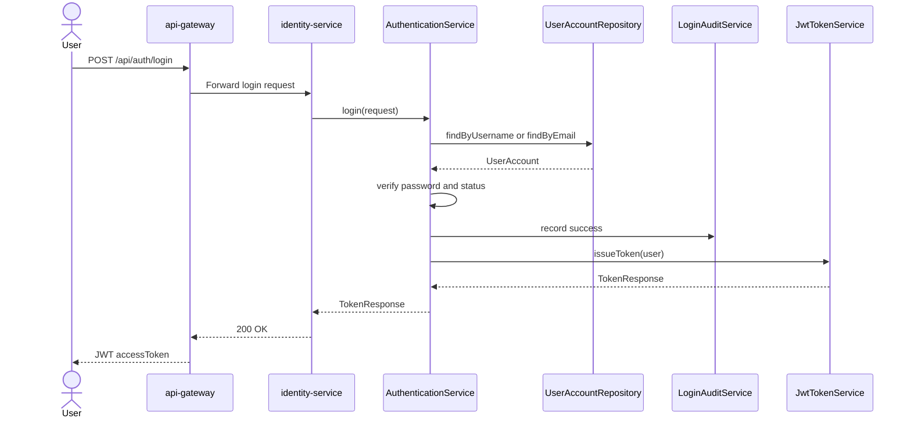

## 4. Diagramme UML - Sequence creation profil et KYC

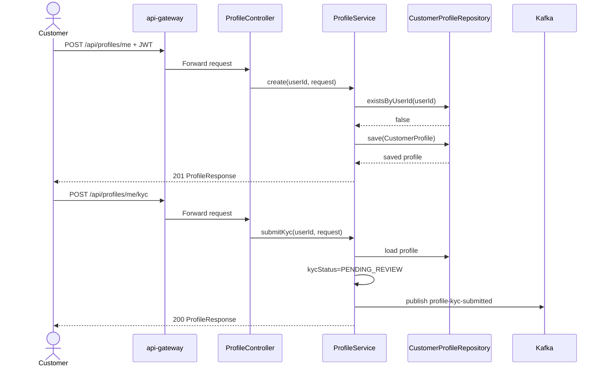

## 5. Diagramme UML - Sequence paiement avec approbation

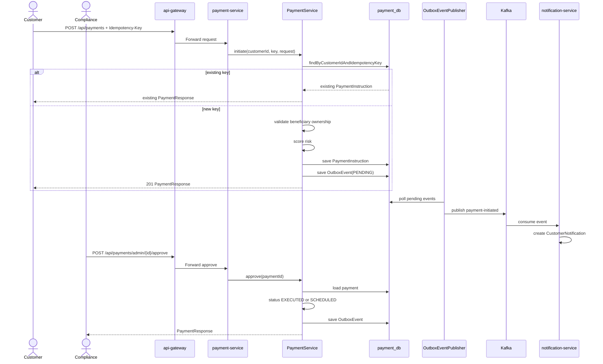

## 6. Diagramme UML - Etats UserAccount

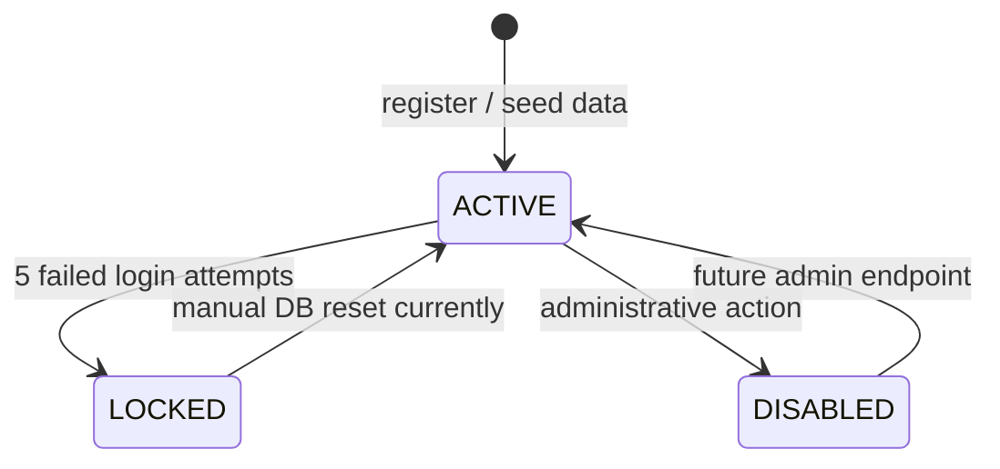

## 7. Diagramme UML - Etats KYC

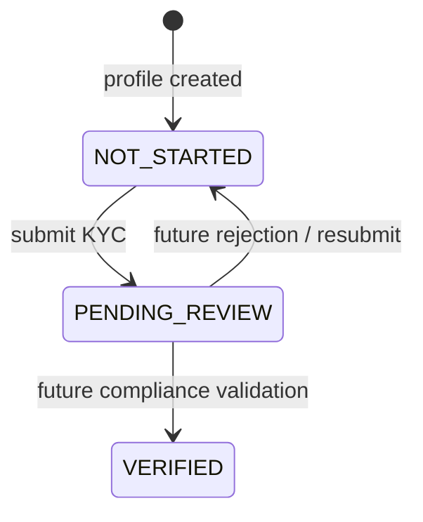

## 8. Diagramme UML - Etats Account

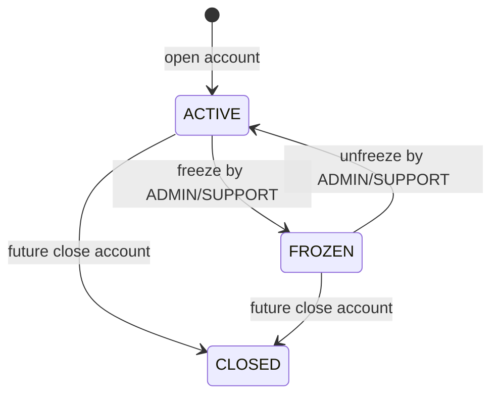

## 9. Diagramme UML - Etats PaymentInstruction

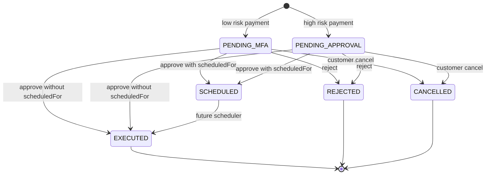

## 10. Diagramme UML - Etats Notification

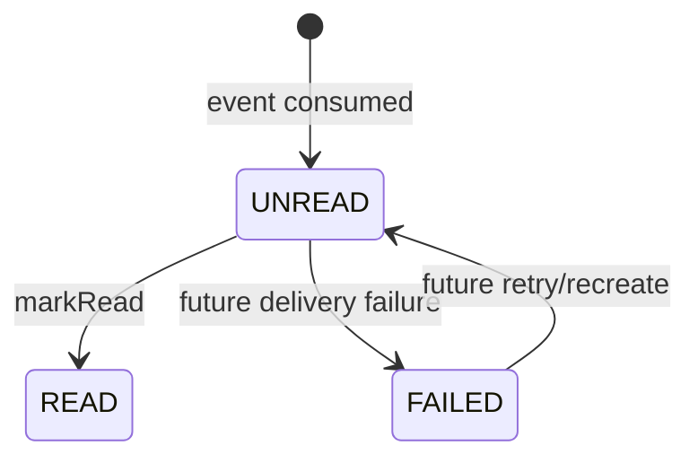

## 11. Diagramme UML - Classes Identity

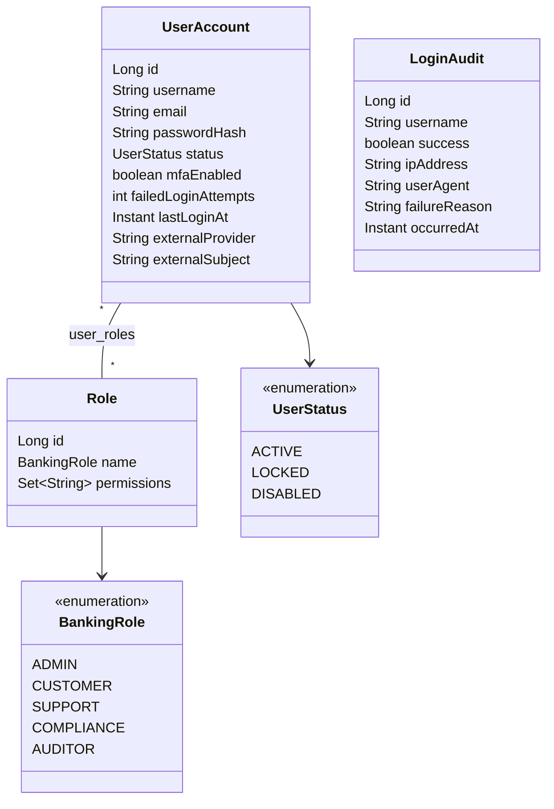

## 12. Diagramme UML - Classes Profile

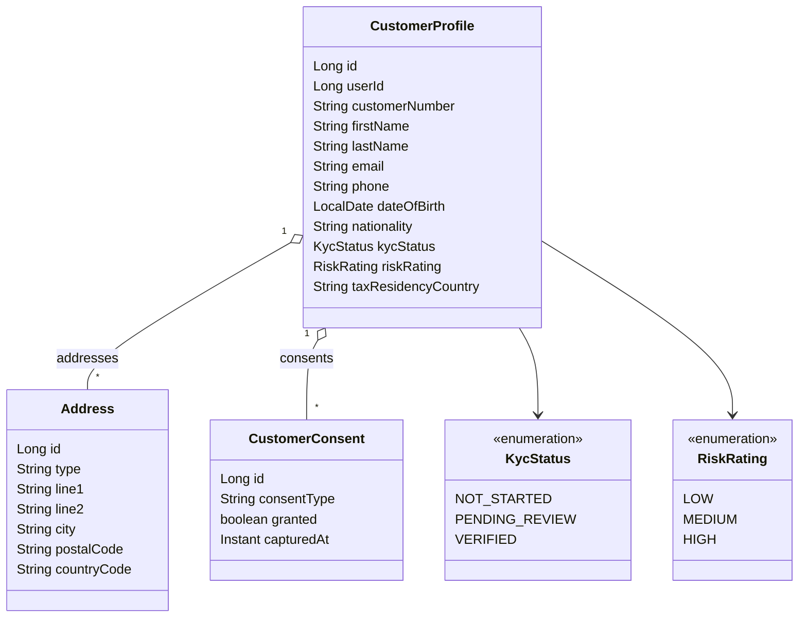

## 13. Diagramme UML - Classes Account

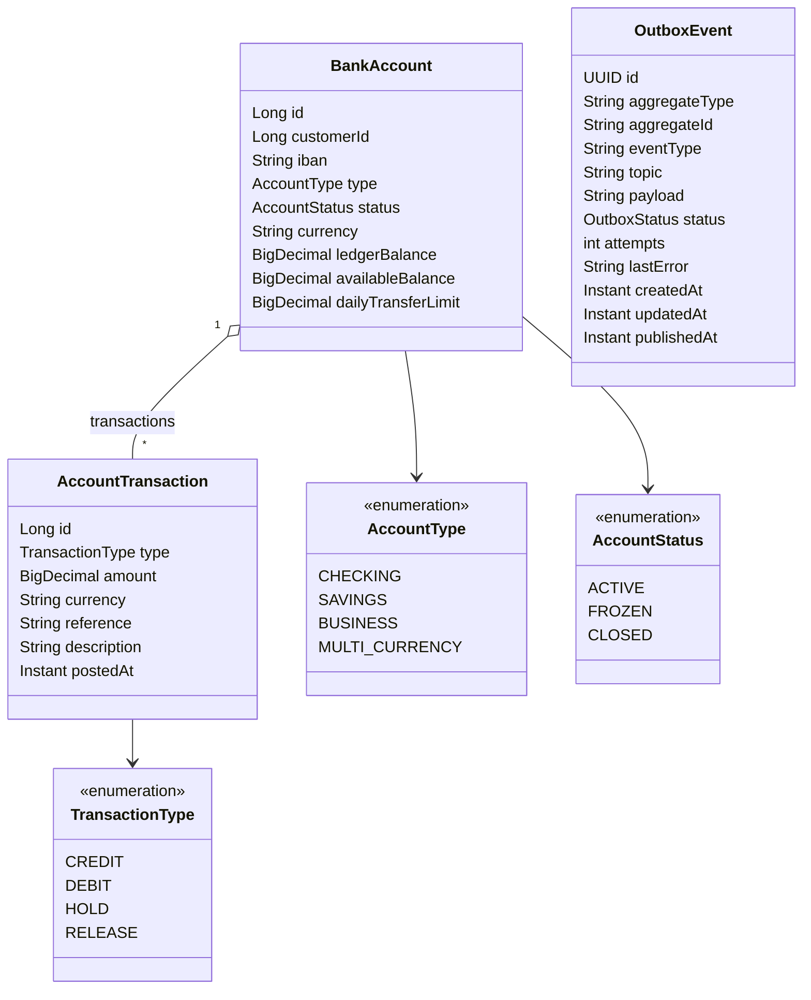

## 14. Diagramme UML - Classes Payment

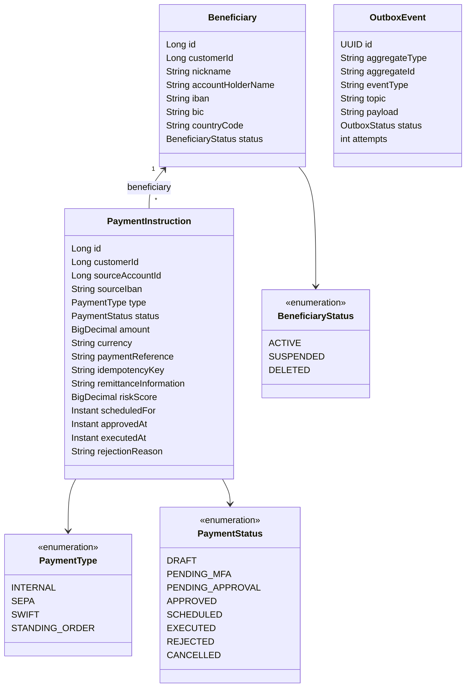

## 15. Diagramme UML - Classes Notification

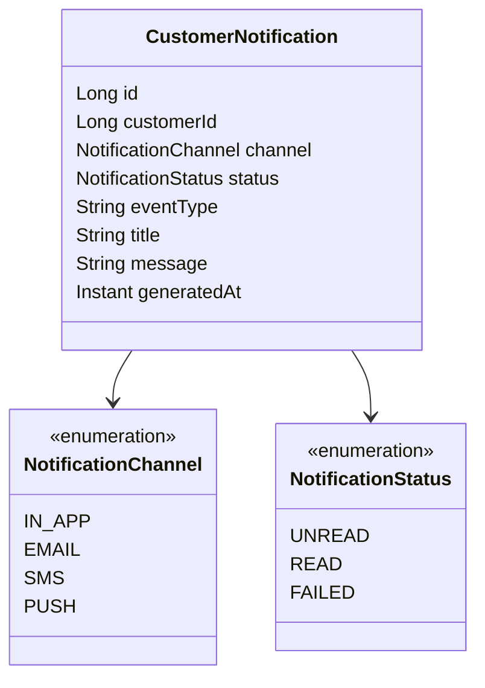

## 16. Diagramme UML - Activite ouverture compte

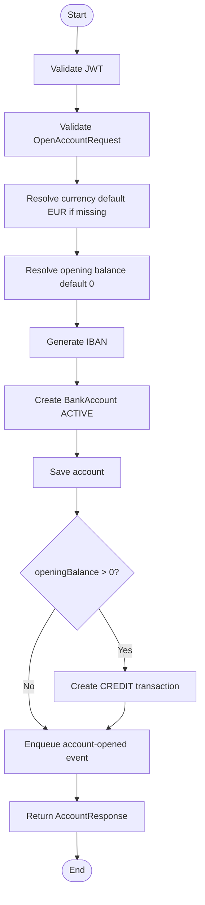

## 17. Diagramme UML - Activite initiation paiement

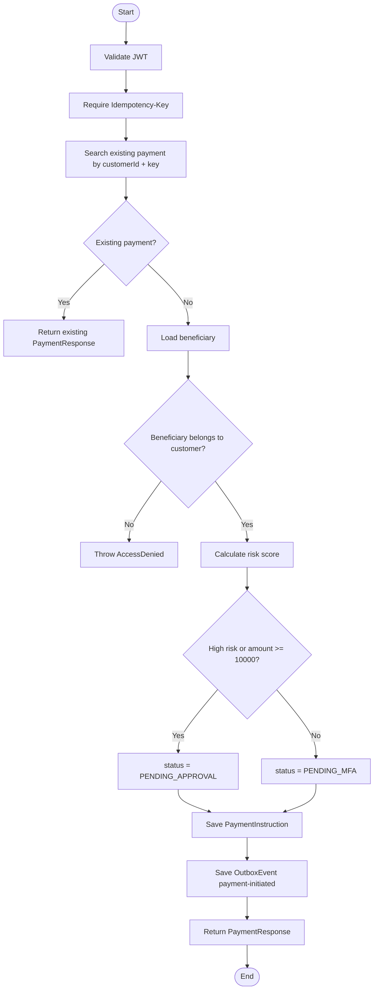

