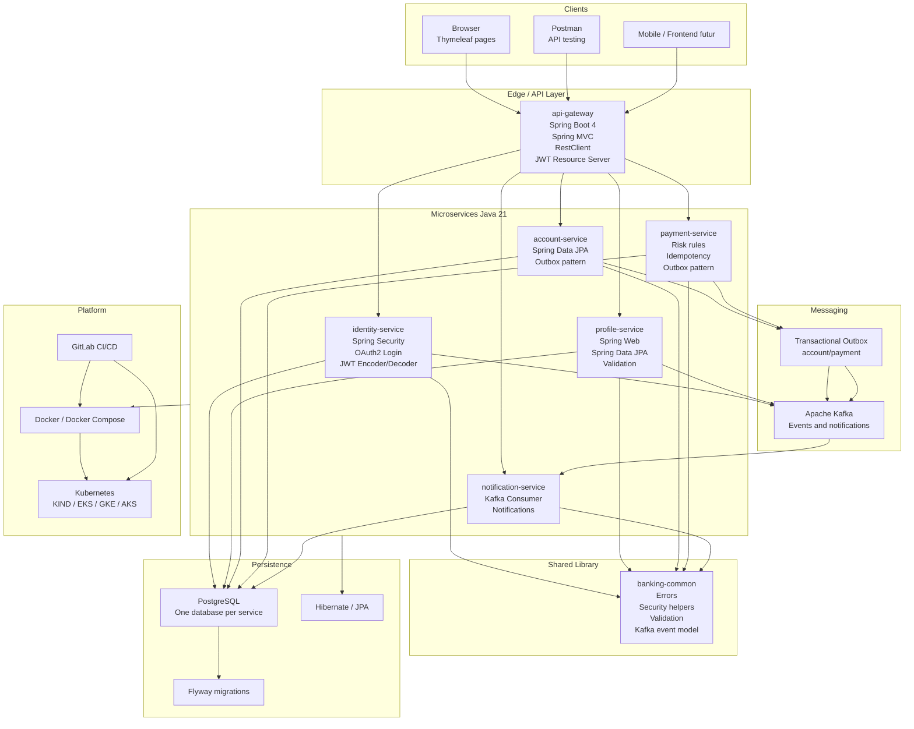
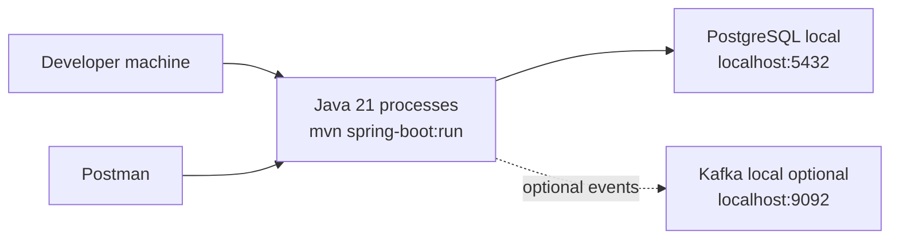
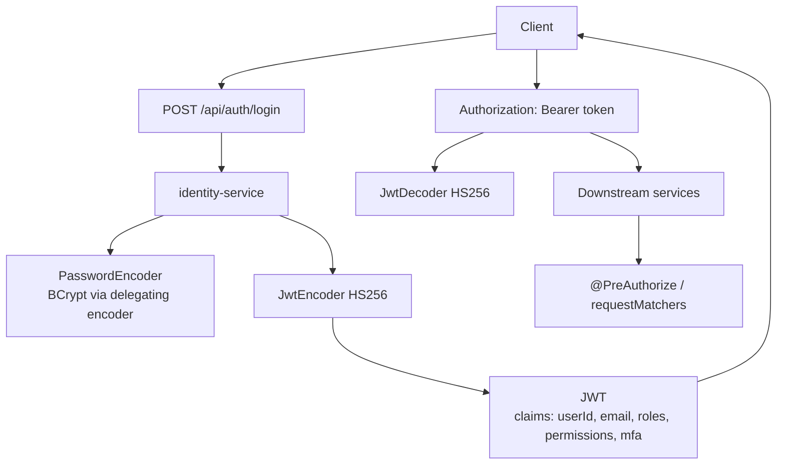
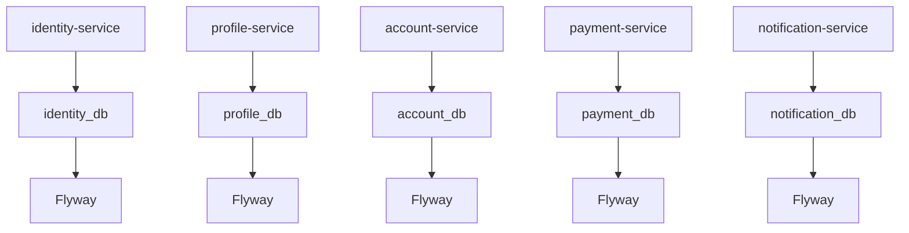
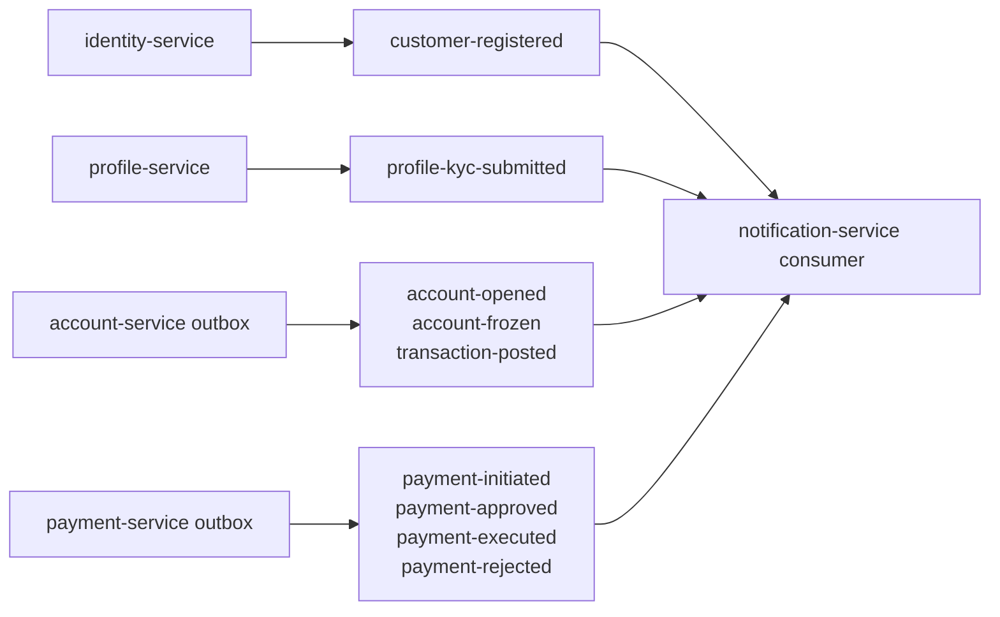
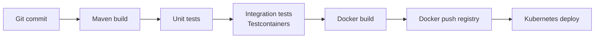

# Banking Account Management System - Stack Technologique

## 1. Objectif

Ce document presente les technologies utilisees par l'application `banking-app` et leur position dans l'architecture.

## 2. Diagramme des technologies



## 3. Stack backend

| Categorie | Technologie | Usage |
| --- | --- | --- |
| Langage | Java 21 | Langage principal |
| Framework | Spring Boot 4.0.6 | Bootstrap des microservices |
| Web | Spring Web MVC | Controllers REST et pages MVC |
| Securite | Spring Security | Auth, RBAC, OAuth2, resource server |
| Token | JWT HS256 | Authentification stateless |
| OAuth2 | Google OAuth2 Login | SSO navigateur |
| Persistence | Spring Data JPA | Repositories |
| ORM | Hibernate | Mapping entites |
| Base | PostgreSQL | Base relationnelle |
| Migration | Flyway | Versioning schema |
| Messaging | Spring Kafka | Producteurs et consommateurs Kafka |
| Validation | Jakarta Validation | Validation DTO |
| Mapping | MapStruct | Mapping DTO/entity |
| Boilerplate | Lombok | Getters, builders, constructors |
| API Docs | Springdoc OpenAPI | Swagger UI et `/v3/api-docs` |
| Templates | Thymeleaf | Pages server-side simples |
| Tests | JUnit 5, Mockito | Unit tests |
| Integration | Testcontainers | PostgreSQL/Kafka en tests avec Docker |

## 4. Stack infrastructure

| Categorie | Technologie | Usage |
| --- | --- | --- |
| Conteneurisation | Docker | Packaging applicatif |
| Local compose | Docker Compose | Postgres, Kafka, Zookeeper, services optionnels |
| Orchestration | Kubernetes | Deploiement cloud ou KIND |
| CI/CD | GitLab CI | Build, tests, docker build/push, deploy |
| Messaging infra | Kafka + Zookeeper | Broker local compose |
| Cloud cible | EKS/GKE/AKS | Clusters Kubernetes managés |

## 5. Runtime local sans Docker

Mode local leger:



Services a lancer localement:

```text
identity-service      8081
profile-service       8082
account-service       8083
payment-service       8084
notification-service  8085
api-gateway           8080
```

Le gateway expose l'API unifiee:

```text
http://localhost:8080
```

## 6. Configuration par profiles

Chaque service contient:

```text
application.yml
application-dev.yml
application-tst.yml
application-uat.yml
application-pp.yml
application-prod.yml
```

Les profiles couvrent:

- datasource PostgreSQL;
- Kafka bootstrap servers;
- logging;
- securite JWT/OAuth2;
- configuration specifique metier.

Le profil `dev` actuel utilise:

```text
DB_URL=jdbc:postgresql://localhost:5432/<service_db>
DB_USERNAME=postgres
DB_PASSWORD=1999
KAFKA_BOOTSTRAP_SERVERS=localhost:9092
JWT_SECRET=dev-banking-secret-change-me-at-least-32-bytes
APP_ALLOWED_ORIGIN=http://localhost:8080
```

## 7. Technologies de securite



Securite actuelle:

- login username ou email;
- hash de mot de passe;
- JWT stateless;
- RBAC par roles;
- permissions dans le token;
- lock apres echecs de login;
- CORS configurable;
- OAuth2 Google Login cote navigateur;
- erreurs structurees via `ApiError`.

Renforcements production recommandes:

- utiliser RS256/ES256 avec JWKS au lieu d'un secret HS256 partage;
- rotation des secrets;
- refresh tokens;
- change password et reset password;
- MFA reel TOTP/SMS/email/push;
- rate limiting;
- audit trail expose aux roles autorises;
- secrets stockes dans Vault/Kubernetes Secrets.

## 8. Technologies de donnees

Le modele applique `database per service`.



Avantages:

- isolation des domaines;
- migrations independantes;
- evolution autonome;
- reduction du couplage direct.

Contraintes:

- pas de jointure SQL inter-services;
- coherence distribuee via evenements;
- references inter-services par identifiant (`userId`, `customerId`, `accountId`).

## 9. Technologies Kafka

Kafka sert a decoupler les producteurs et les notifications.



Configuration fiabilite producteur:

```text
acks=all
enable.idempotence=true
retries=10
```

Le consumer notification:

```text
group-id=notification-service
auto-offset-reset=earliest
enable-auto-commit=false
```

## 10. Technologies de documentation et tests

Swagger UI par service:

```text
http://localhost:8081/swagger-ui.html
http://localhost:8082/swagger-ui.html
http://localhost:8083/swagger-ui.html
http://localhost:8084/swagger-ui.html
http://localhost:8085/swagger-ui.html
```

OpenAPI JSON:

```text
http://localhost:8081/v3/api-docs
http://localhost:8082/v3/api-docs
http://localhost:8083/v3/api-docs
http://localhost:8084/v3/api-docs
http://localhost:8085/v3/api-docs
```

Tests existants identifies:

- validation IBAN dans `banking-common`;
- tests service account;
- tests repository account avec Testcontainers PostgreSQL;
- tests service payment.

Postman sert aux tests fonctionnels manuels et aux scenarios bout en bout.

## 11. CI/CD conceptuel



Stages attendus:

```text
build
test
docker build
docker push
kubernetes deploy
```

## 12. Synthese

L'application utilise une stack Java/Spring moderne, avec:

- microservices decoupes par domaine;
- gateway REST;
- PostgreSQL par service;
- Flyway pour migrations;
- Kafka pour evenements;
- outbox pour fiabiliser account/payment;
- JWT/RBAC pour securite;
- Swagger pour exposition API;
- Docker/Kubernetes/GitLab CI pour industrialisation;
- Postman pour validation fonctionnelle locale.

